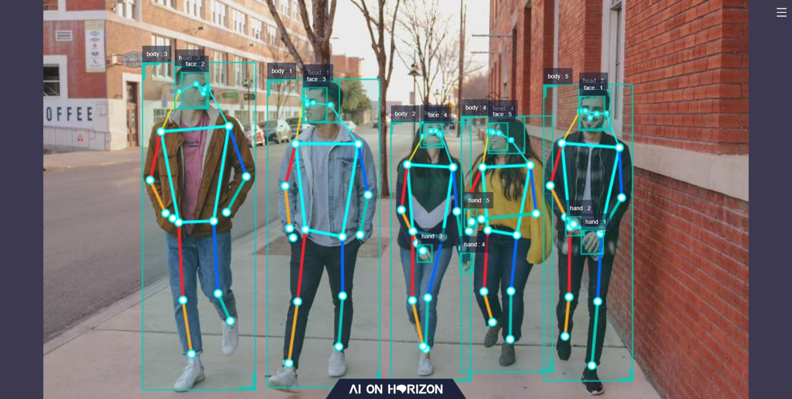

<style>
pre {
    overflow-y: auto;
    max-height: 240px;
}
</style>
# 视觉人体跟随机器人

通过单目摄像头进行目标人体检测与跟踪，以此生成运动控制指令实现机器人自动跟随目标人运动。
<div align="center">

</div>

# 物理环境运行

## 物品清单

| 物品名称 | 数量 | 购买链接 |
| :------------ | :-----: | :-------: |
| OriginBot智能机器人 | 1 |  [购买](https://class.guyuehome.com/p/t_pc/goods_pc_detail/goods_detail/SPU_ENT_16652164516Tu5oIXjFa3Vo?fromH5=true "OriginBot") |

## 使用介绍

### 搭建OriginBot

1. 参考[OrgionBot硬件组装](http://originbot.org/guide/hardware_setup/ "OrgionBot硬件组装")或者说明书完成小车的硬件大家搭建。

2. 参考[OrgionBot软件配置](http://originbot.org/guide/image_install/ "OrgionBot软件配置")完成小车的软件配置。

3. 参考[OrigionBot快速上手](http://originbot.org/guide/easy_start/ "OrigionBot快速上手")验证OrigionBot基本功能。

### 安装运行

1. 参考[旭日X3派网络配置](https://developer.horizon.ai/api/v1/fileData/documents_pi/System_Configuration/System_Configuration.html#id3 "旭日X3派网络配置")进行网络配置，确保其能够正常访问互联网。

2. 点击当前页面右上方“一键部署”按钮，复制命令在X3派上执行。正常启动日志如下：

```shell
[body_tracking-7] [WARN] [1653430533.523069034] [ParametersClass]: TrackCfg param are
[body_tracking-7] activate_wakeup_gesture: 0
[body_tracking-7] track_serial_lost_num_thr: 100
[body_tracking-7] activate_robot_rotate_thr: 45
[body_tracking-7] activate_robot_move_thr: 5
[body_tracking-7] move_step: 0.3
[body_tracking-7] rotate_step: 0.5
[body_tracking-7] img_width: 960
[body_tracking-7] img_height: 544
[body_tracking-7] 
[body_tracking-7] [WARN] [1653430533.712812076] [TrackingManager]: update frame_ts 395787, 873
[body_tracking-7] [WARN] [1653430533.713105576] [TrackingManager]: Tracking body start!, track_id: 1, frame_ts: 395787, tracking_sta(0:INITING, 1:TRACKING, 2:LOST): 1, gesture: 0
[body_tracking-7] [WARN] [1653430535.018442618] [TrackingManager]: Do move! body_rect_width: 353, thr: 864, move_step_ratio: 1, body_rect_to_top: 20, img_height: 544, move_step: 0.3
[body_tracking-7] [WARN] [1653430535.220268535] [TrackingManager]: Do rotate move, ts sec: 3397, nanosec: 387800000
[body_tracking-7] [WARN] [1653430535.220408576] [RobotCmdVelNode]: RobotCtl, angular: 0 0 0, linear: 0.3 0 0, pub twist ts: 1653430535220394
```

### 功能体验

#### 查看算法效果

在浏览器中输入XXX可看到摄像头实时画面，当视场中有人体出现时会显示对应的检测框和ID信息

<div align="center">

</div>

#### 体验人体跟随

将OrgionBot放置在地面上，当其视场中出现人体时，自动进行人体跟随。若启动时视场中存在多个人体，则以当前占据视场面积最大的人体作为跟踪目标，持续跟随移动。

<div align="center">
<video src="./project_info/images/humman_following.mp4"></video>
</div>

# 仿真环境运行

## 物品清单
| 物料名称 | 数量 | 购买链接 |
| :------------ | :-----: | :-------: |
| 地平线旭日X3派 | 1 | [购买](https://developer.horizon.ai/sunrise "RDK X3") |

## 使用介绍

### 配置仿真环境

1. 参考[ROS2 foxy安装说明](https://docs.ros.org/en/foxy/Installation/Ubuntu-Install-Debians.html "ROS2 foxy 安装说明")在PC Ubuntu系统装安装ROS2 Foxy。

2. PC Ubuntu系统安装turtlesim

```shell
sudo apt update
sudo apt install ros-foxy-turtlesim
```
3. 确保PC ubuntu和旭日X3派处于同一个网段

### 旭日X3派运行

1. 正确连接摄像头与旭日X3派

2. 在旭日X3派上执行以下命令启动人体跟随功能
```shell
sudo apt update
sudo apt install XXX
source /opt/tros/local_setup.bash
ros2 launch xxx
```
正常启动日志如下：
```shell
[body_tracking-7] [WARN] [1653430533.523069034] [ParametersClass]: TrackCfg param are
[body_tracking-7] activate_wakeup_gesture: 0
[body_tracking-7] track_serial_lost_num_thr: 100
[body_tracking-7] activate_robot_rotate_thr: 45
[body_tracking-7] activate_robot_move_thr: 5
[body_tracking-7] move_step: 0.3
[body_tracking-7] rotate_step: 0.5
[body_tracking-7] img_width: 960
[body_tracking-7] img_height: 544
[body_tracking-7] 
[body_tracking-7] [WARN] [1653430533.712812076] [TrackingManager]: update frame_ts 395787, 873
[body_tracking-7] [WARN] [1653430533.713105576] [TrackingManager]: Tracking body start!, track_id: 1, frame_ts: 395787, tracking_sta(0:INITING, 1:TRACKING, 2:LOST): 1, gesture: 0
[body_tracking-7] [WARN] [1653430535.018442618] [TrackingManager]: Do move! body_rect_width: 353, thr: 864, move_step_ratio: 1, body_rect_to_top: 20, img_height: 544, move_step: 0.3
[body_tracking-7] [WARN] [1653430535.220268535] [TrackingManager]: Do rotate move, ts sec: 3397, nanosec: 387800000
[body_tracking-7] [WARN] [1653430535.220408576] [RobotCmdVelNode]: RobotCtl, angular: 0 0 0, linear: 0.3 0 0, pub twist ts: 1653430535220394
```
### 功能体验

#### 查看算法效果

在浏览器中输入XXX可看到摄像头实时画面，当视场中有人体出现时会显示对应的检测框和ID信息

<div align="center">

</div>

#### 体验人体跟随

固定好旭日X3派与摄像头，当其视场中出现人体时，自动进行人体跟随。若启动时视场中存在多个人体，则以当前占据视场面积最大的人体作为跟踪目标，持续跟随移动。

<div align="center">
<video src="./project_info/images/humman_following.mp4"></video>
</div>

# 参数说明

| 参数名                    | 类型        | 解释                                                         | 是否必须 | 支持的配置                                                   | 默认值                        | 是否支持运行时动态配置 |
| ------------------------- | ----------- | ------------------------------------------------------------ | -------- | ------------------------------------------------------------ | ----------------------------- | ---------------------- |
| track_serial_lost_num_thr | int         | 目标连续消失帧数阈值。超过此阈值认为目标消失。               | 否       | 无限制                                                       | 100                           | 是                     |
| activate_wakeup_gesture   | int         | 是否启用唤醒手势。                                           | 否       | 0/1。0：不启用，1：启用。                                    | 0                             | 是                     |
| move_step                 | float       | 平移运动的步长，单位米。                                     | 否       | 无限制                                                       | 0.1                           | 是                     |
| rotate_step               | float       | 旋转运动的步长，单位弧度。                                   | 否       | 无限制                                                       | 0.5                           | 是                     |
| twist_pub_topic_name      | std::string | 发布Twist类型的运动控制消息的topic名                         | 否       | 根据实际部署环境配置。一般机器人订阅的topic为/cmd_vel，ROS2 turtlesim示例订阅的topic为turtle1/cmd_vel。 | /cmd_vel                      | 否                     |
| ai_msg_sub_topic_name     | std::string | 订阅包含手势识别结果的AI消息的topic名                        | 否       | 根据实际部署环境配置                                         | /hobot_hand_gesture_detection | 否                     |
| img_width                 | int         | 检测框对应的图片分辨率的宽度                                 | 否       | 根据发布的图片分辨率配置                                     | 960                           | 是                     |
| img_height                | int         | 检测框对应的图片分辨率的高度                                 | 否       | 根据发布的图片分辨率配置                                     | 544                           | 是                     |
| activate_robot_move_thr   | int         | 激活平移运动的像素阈值。当人体检测框距离上边界的像素小于此阈值时激活平移运动。 | 否       | 0-img_height                                                 | 5                             | 是                     |
| activate_robot_rotate_thr | int         | 激活旋转运动的欧拉角度，当被跟随人体和机器人之间的角度大于此阈值时激活旋转运动。 | 否       | 0-90                                                         | 45                            | 是                     |

# 设计思路

整个功能由MIPI图像采集、人体检测和跟踪、人体跟随策略、图像编解码、Web展示端组成，流程如下：

<div align="center">

</div>

首先由MIPI摄像头/USB摄像头获取图像数据，送至Body Dectection模块进行人体识别和跟踪，以及Hobot Codec模块进行图像压缩。Following Strategy模块根据人体识别结果生成对应的控制指令控制小车完成跟随动作。WebService模块结合压缩后的图像和人体识别跟踪结果，进行web实施效果展示。

各模块串联通过launch脚本加载
```python
import os

from launch import LaunchDescription
from launch_ros.actions import Node

from launch.actions import IncludeLaunchDescription
from launch.launch_description_sources import PythonLaunchDescriptionSource
from ament_index_python import get_package_share_directory

def generate_launch_description():
    web_service_launch_include = IncludeLaunchDescription(
        PythonLaunchDescriptionSource(
            os.path.join(
                get_package_share_directory('websocket'),
                'launch/hobot_websocket_service.launch.py'))
    )

    return LaunchDescription([
        web_service_launch_include,
        # 启动图片发布pkg
        Node(
            package='mipi_cam',
            executable='mipi_cam',
            output='screen',
            parameters=[
                {"out_format": "nv12"},
                {"image_width": 960},
                {"image_height": 544},
                {"io_method": "shared_mem"},
                {"video_device": "F37"}
            ],
            arguments=['--ros-args', '--log-level', 'error']
        ),
        # 启动jpeg图片编码&发布pkg
        Node(
            package='hobot_codec',
            executable='hobot_codec_republish',
            output='screen',
            parameters=[
                {"channel": 1},
                {"in_mode": "shared_mem"},
                {"in_format": "nv12"},
                {"out_mode": "ros"},
                {"out_format": "jpeg"},
                {"sub_topic": "/hbmem_img"},
                {"pub_topic": "/image_jpeg"}
            ],
            arguments=['--ros-args', '--log-level', 'error']
        ),
        # 启动单目rgb人体、人头、人脸、人手框和人体关键点检测pkg
        Node(
            package='mono2d_body_detection',
            executable='mono2d_body_detection',
            output='screen',
            parameters=[
                {"ai_msg_pub_topic_name": "/hobot_mono2d_body_detection"}
            ],
            arguments=['--ros-args', '--log-level', 'error']
        ),
        # 启动web展示pkg
        Node(
            package='websocket',
            executable='websocket',
            output='screen',
            parameters=[
                {"image_topic": "/image_jpeg"},
                {"image_type": "mjpeg"},
                {"smart_topic": "/hobot_mono2d_body_detection"}
            ],
            arguments=['--ros-args', '--log-level', 'error']
        ),
        # 启动人体跟随pkg
        Node(
            package='body_tracking',
            executable='body_tracking',
            output='screen',
            parameters=[
                {"ai_msg_sub_topic_name": "/hobot_mono2d_body_detection"},
                {"activate_wakeup_gesture": 0},
                {"img_width": 960},
                {"img_height": 544},
                {"track_serial_lost_num_thr": 30},
                {"move_step": 0.5},
                {"rotate_step": 0.5},
                {"activate_robot_move_thr": 5}
            ],
            arguments=['--ros-args', '--log-level', 'info']
        )
    ])
```

其中

MIPI图像采集使用方式可参考[hobot_sensors使用指南](www.baidu.com)

人体检测和跟踪使用可参考[hobot_body_tracking使用指南](www.baidu.com)

图像编解码使用方式可参考[hobot_codec使用指南](www.baidu.com)

Web展示端使用方式可参考[web_service使用指南](www.baidu.com)


# 常见问题


